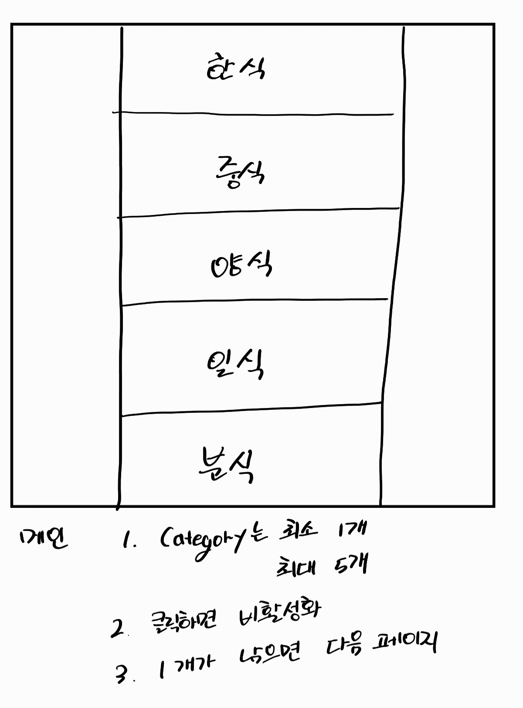

# '뭐먹지' 개발기 1편

아이디어나 기획은 작년에 해놨지만 1년이 지난 지금에서야 완성한 첫 토이 프로젝트 뭐먹지(what-eat). 앞으로 3번에 걸쳐 '뭐먹지'를 개발하며 겪었던 이야기를 공유하려 합니다.

### 뭐먹지?

점심과 저녁 메뉴를 선뜻 고르지 못하고 하던 작은 미니게임이 있었습니다. 한식, 중식, 양식, 일식, 분식 중 오늘은 먹고 싶지 않은 카테고리를 빼고 남은 카테고리에서 메뉴를 고르는 방식의 게임이었죠.

'뭐먹지'는 그 게임을 고스란히 인터넷으로 옮겨놓은 프로젝트입니다.

### 실패

사실 뭐먹지는 이미 몇번이고 제 repository에 이런 저런 형태와 이름으로 만들어졌다가 사라졌습니다. 그 잔재가 남아있기도 하죠. ([https://github.com/wesbin/what-eat/releases/tag/v20210317](https://github.com/wesbin/what-eat/releases/tag/v20210317)) 다시 생각해도 이 버전은 참 맘에 들지 않습니다.

다행히 저는 여기서 멈출 이유는 없었습니다. 저는 '실패'를 성공의 어머니로 만들기 위해 이유를 한번 찾아보기로 합니다.

### 실패의 이유

결론은 이렇습니다. **디테일한 계획(혹은 기획)의 부족.**

실패했던 프로젝트들을 돌이켜 보면 저는 "그건 그렇게 하고, 저건 그렇게 만들면 되겠지"라며 프로젝트를 시작했습니다. 그저 머릿 속으로 생각한 목업(Mock-up) 수준의 것을 구현하려 했던 것이죠. 지금 생각하면 그 결과는 뻔한 것이었죠.

### 다시 뭐먹지

정말 별거 없는 기획서입니다. ~~혼자 볼땐 몰랐는데 올려서 보니 글씨 정말 안 이쁘네~~ 갤럭시 탭에 머릿 속에 있던 내용을 꺼내놓으면서 배포나 구현을 어떤 식으로 할 것인지 조사하고 메모해둔 수준이죠. 그 와중에 중간에 3번 정돈 조금씩 내용이 바뀌기도 했습니다. 하지만 그런 기획서이지만 없는 것과 있는 것의 차이는 엄청 났습니다.

**'뭐먹지'가 완성이 되었으니까요!!**

완성된 '뭐먹지'는 [https://wesbin.github.io/what-eat/](https://wesbin.github.io/what-eat/) 에서 체험하실수 있으십니다.

글 읽어주셔서 감사합니다. 2편으로 다시 돌아올게요.